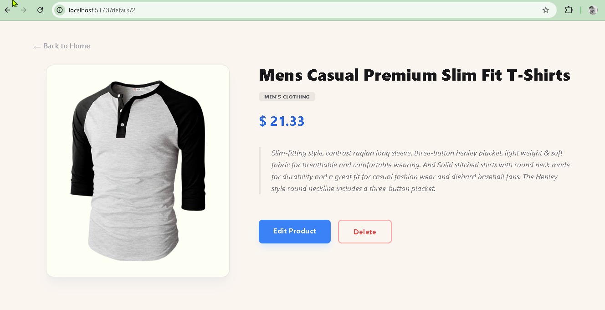
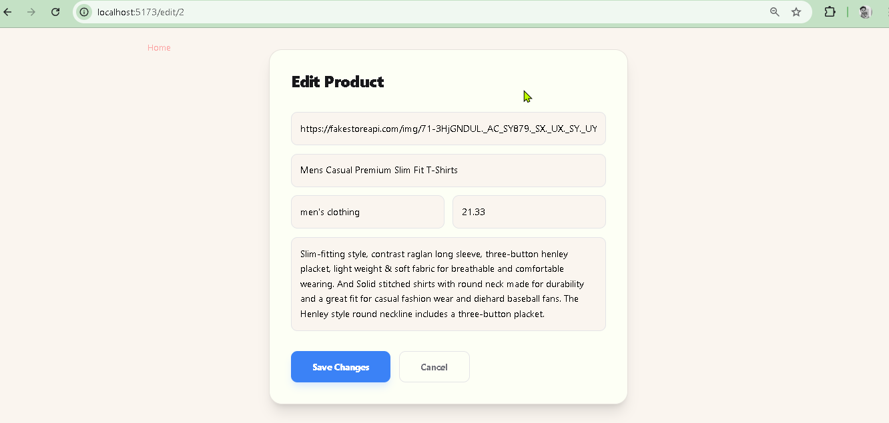

# 🛍️ React Product Management App

A modern Product Management Web Application built using React.  
This project allows users to add, edit, delete, and view product details with category filtering.

---

## 🚀 Features

- 🏠 View all products
- ➕ Add new product
- ✏️ Edit existing product
- ❌ Delete product
- 🔍 View product details
- 📂 Category filter
- 📱 Fully Responsive UI

---

## 🛠️ Tech Stack

- React.js
- React Router
- Context API
- Tailwind CSS
- FakeStore API (for initial data)

---

## 📸 Project Demo Screenshots

---

### 🏠 Home Page

Displays all products with category filter on the left side.


---

### ➕ Add New Product

Form to create a new product with image URL, title, category, price and description.


---

### 🔍 Product Details Page

Shows complete product information with Edit and Delete options.



---

### ✏️ Edit Product Page

Allows updating existing product details.



---

## ⚙️ Installation & Setup

Clone the repository:

```bash
git clone https://github.com/yourusername/your-repo-name.git